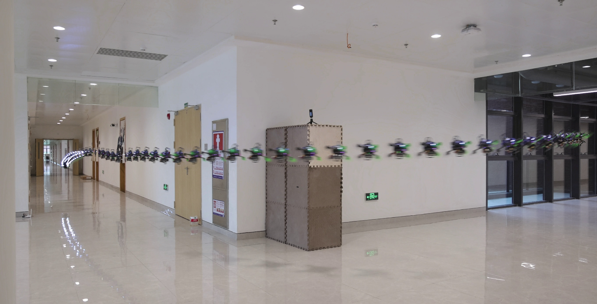

# composite_image
This repo provide a python script to create a composite image from a video.

# Dependency

```bash
pip install opencv-python
```

# Example

## 1 VAR Mode (Recommend)

```bash
python composite_image.py --video_path=./example_video.mp4 --start_t=0.0 --end_t=99.0 --skip_frame=2 --mode=VAR
```
## 2 MIN Mode


```bash
python composite_image.py --video_path=./example_video.mp4 --start_t=0.0 --end_t=99.0 --skip_frame=2 --mode=MIN
```


## 3 MAX Mode
```bash
python composite_image.py --video_path=./example_video.mp4 --start_t=0.0 --end_t=99.0 --skip_frame=2 --mode=MAX
```


# Parameter

* --video_path: The path of the input video.
* --start_t: the start time of the composite image.
* --end_t: the end time of the composite image.
* --skip_frame: skip frame number when extracting frames, input `1` for not skipping any frame.
* --mode: mode of image merging, three choices is implemented:
  * VAR (Recommend): Use the pixel that is furthest from the mean of the image
  * MAX: Keep the lightest pixel.
  * MIN: Keep the darkest.
